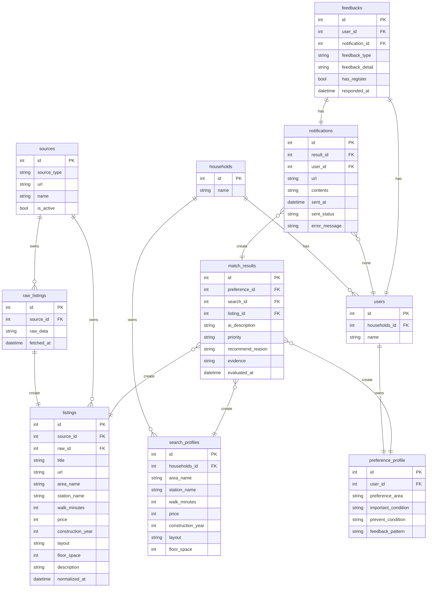

# HouseParchaseConcergeBot

住宅購入向けの **個人用コンシェルジュBot** です。  
候補条件に合う新着物件を定期取得し、AI が短い要約と優先度を付けて LINE に通知することを目指します。

---

## まず最初に読む要約

- **何を作るか**: 新着物件監視 + 厳密条件フィルタ + AI要約/優先度付け + LINE通知
- **何はまだやらないか**: 高度なUI、フル自律エージェント、外部調査自動化、自動問い合わせ
- **MVPの核**: 取得 / 正規化 / フィルタ / 重複排除 / AIスコアリング / 通知
- **設計思想**: ルールで決められることはコードで、曖昧さの処理だけ AI に任せる
- **最初の実装順**: 開発基盤 → API雛形 → ドメインモデル → DB → Rule Engine → SourceAdapter → 通知

---

## メンタルモデル（ドメインモデルの全体像）

### ざっくり理解

このシステムは、以下の流れで考えると追いやすいです。

1. **SearchProfile** が「どんな物件を探したいか」を表す
2. **SourceAdapter** が物件ソースからデータを取得する
3. 取得した生データを **RawListing** として保存する
4. それを **Listing** という共通形式に正規化する
5. **Rule Engine** が厳密条件でふるいにかける
6. 通過した物件に対して AI が **MatchResult** を作る
7. **NotificationService** が LINE に通知する

### ドメイン用語の最小セット

- **SearchProfile**: 検索条件セット
- **RawListing**: ソースから取得した生データ
- **Listing**: 共通形式に正規化した物件データ
- **MatchResult**: AI要約・優先度・理由を持つ評価結果
- **Notification**: 送信した通知の記録
- **Feedback**: ユーザーが後で返す「興味あり / 見送り」などの反応

---

## データモデルの考え方

### SearchProfile
「何を探すか」を表す条件セット。  
候補地、徒歩上限、対象種別などを持つ。

### RawListing
各ソース固有の生データ。  
将来、Normalizer を見直したくなったときのために残す。

### Listing
ソース差異を吸収した共通物件モデル。  
アプリ全体では基本的にこの形を使う。

### MatchResult
AI が作る評価結果。  
通知文を作る前段階の「意味づけ」データ。

### Notification
何をいつ送ったかの履歴。  
再通知防止や後での確認に使う。

### Feedback
将来の順位改善に使う。  
MVPでは保存枠だけを先に作る。

---

# データモデル

このドキュメントは、House Purchase Concierge Bot のデータモデルを記述する。
SQLAlchemyによる実装は `app/infra/db/` 配下にある。

## ER図

## テーブル詳細

---
### 1. 利用者関係
#### households
家庭を表す。

家庭には複数人のユーザーが入ることがある。

| カラム名 | 型      | 制約     | 説明     |
|---------|---------|----------|----------|
|id       |int      |PK        |世帯ID    |
|name     |string   |          |世帯名    |

#### users
利用ユーザー一人を表す。

| カラム名 | 型      | 制約     | 説明     |
|---------|---------|----------|----------|
|id       |int      |PK        |ユーザーID|
|household_id|int|FK|所属する世帯ID|
|name     |string   |          |ユーザー名    |

#### search_profiles
検索条件のセット。

1世帯に1つの検索条件を保有するものとする。
| カラム名 | 型      | 制約     | 説明     |
|---------|---------|----------|----------|
|id       |int      |PK        |検索条件ID|
|household_id|int|FK|この条件を保有している世帯ID|
|area_name     |string   |          |エリア名    |
|station_name|string| |最寄り駅|
|walk_minutes|int||最寄り駅までの徒歩時間|
|price|int| |金額|
|construction_year|int| |築年数|
|layout|string| |間取り|
|floor_space|int| |坪数|
|property_type|string| |物件種別(マンション/戸建て/注文住宅)|

ToDo:検索条件は都度増えそうなので増やしやすいようにしておかないといけない。

#### preference_profile
ユーザーの好み・傾向を表す。
| カラム名 | 型      | 制約     | 説明     |
|---------|---------|----------|----------|
|id       |int      |PK        |ユーザー嗜好ID|
|user_id|int|FK|該当ユーザーID|
|preference_area|string| |好みのエリア|
|important_condition|string| |重視する条件|
|prevent_condition|string| |避ける条件|
|feedback_pattern|string| |フィードバックの傾向|

ToDo:ユーザーの好みをどうやってデータベースで表現できるか？

---

### 2. データ取得関係
#### sources
物件を取得するサイトやデータベースを表す。
| カラム名 | 型      | 制約     | 説明     |
|---------|---------|----------|----------|
|id       |int      |PK        |ソースのID|
|source_type|string||ソース種別(Webサイト/社内DB)|
|url|string||ソースの接続先|
|name|string| |ソース名|
|is_active|bool||現在有効か|

ToDO:source_listing_idやsource_listing_keyが必要とREADME.mdにはあるが、それらの意味が不明。

#### raw_listings
物件ソースから取得した生データを表す。
| カラム名 | 型      | 制約     | 説明     |
|---------|---------|----------|----------|
|id       |int      |PK        |生データID|
|source_id|int|FK|取得ソースID|
|raw_data|string||生データ|
|fetched_at|datetime||取得日時|

#### listings
生データを正規化したもの
| カラム名 | 型      | 制約     | 説明     |
|---------|---------|----------|----------|
|id       |int      |PK        |データID|
|source_id|int|FK|取得ソースID|
|raw_id|int|FK|生データID|
|title|string||タイトル|
|url|string||ソースのurl|
|area_name     |string   |          |エリア名    |
|station_name|string| |最寄り駅|
|walk_minutes|int||最寄り駅までの徒歩時間|
|price|int| |金額|
|construction_year|int| |築年数|
|layout|string| |間取り|
|floor_space|int| |坪数|
|description|string| |備考|
|normalized_at|datetime||正規化日時|

ToDo:listingsからsourcesに直接外部キーは必要か？(raw_listingsを経由すればsourcesの情報は参照可能)
ToDo:おそらくlistingsとsearch_profilesは同じカラムができるのではないかと思われる
ToDo:随時追加が必要であると思われる。
---

### 3. 結果・通知関係
#### match_results
それまでのフィードバックと検索結果を踏まえたAIの分析結果
| カラム名 | 型      | 制約     | 説明     |
|---------|---------|----------|----------|
|id       |int      |PK        |結果ID|
|listing_id|int|FK|正規化データのID|
|preference_id|int|FK|ユーザーの嗜好ID|
|search_id|int|FK|検索条件ID|
|ai_description|string| |AI要約|
|priority|string| |優先度スコア|
|recommend_reason|string| |おすすめ理由|
|evidence|string||根拠データ| 
|evaluated_at|datetime||AI評価した日時|

#### notifications
通知を表す
| カラム名 | 型      | 制約     | 説明     |
|---------|---------|----------|----------|
|id       |int      |PK        |通知ID|
|result_id|int|FK|結果ID(送信の内容)|
|user_id|int|FK|送信先ユーザーID|
|url|string||通知先URL|
|contents|string||通知内容|
|sent_at|datetime||送信日時|
|sent_status|string||送信状況(成功/失敗)|
|error_message|string||送信エラーメッセージ|

#### feedbacks
ユーザーからのフィードバックを表す
| カラム名 | 型      | 制約     | 説明     |
|---------|---------|----------|----------|
|id       |int      |PK        |フィードバックID|
|usr_id|int|FK|ユーザーID|
|notification_id|int|FK|フィードバック対象の結果ID|
|feedback_type|string||フィードバック種別(気になる/いまいち/後で見る)|
|feedback_detail|string||フィードバック内容(ユーザーの入力内容)|
|has_register|bool||preferenceProfileに反映済みか否か|
|responded_at|datetime||フィードバック日時|

