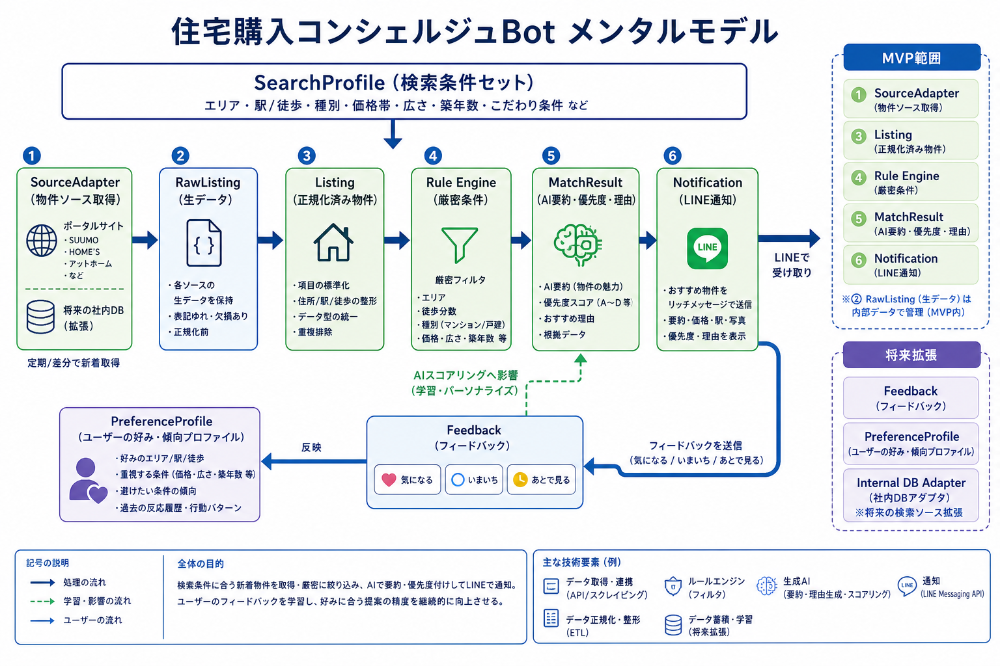
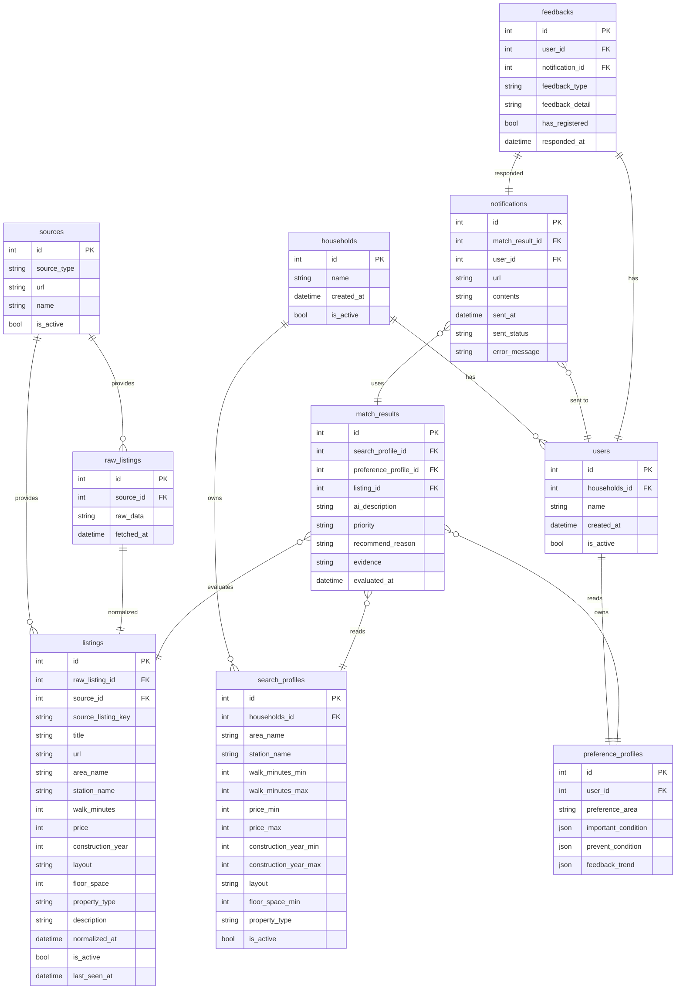

# HouseParchaseConcergeBot

住宅購入向けの **個人用コンシェルジュBot** です。  
候補条件に合う新着物件を定期取得し、AI が短い要約と優先度を付けて LINE に通知することを目指します。

---

## まず最初に読む要約

- **何を作るか**: 新着物件監視 + 厳密条件フィルタ + AI要約/優先度付け + LINE通知
- **何はまだやらないか**: 高度なUI、フル自律エージェント、外部調査自動化、自動問い合わせ
- **MVPの核**: 取得 / 正規化 / フィルタ / 重複排除 / AIスコアリング / 通知
- **設計思想**: ルールで決められることはコードで、曖昧さの処理だけ AI に任せる
- **最初の実装順**: 開発基盤 → API雛形 → ドメインモデル → DB → Rule Engine → SourceAdapter → 通知

---

## メンタルモデル（ドメインモデルの全体像）

### ざっくり理解

このシステムは、以下の流れで考えると追いやすいです。

1. **SearchProfile** が「どんな物件を探したいか」を表す
2. **SourceAdapter** が物件ソースからデータを取得する
3. 取得した生データを **RawListing** として保存する
4. それを **Listing** という共通形式に正規化する
5. **Rule Engine** が厳密条件でふるいにかける
6. 通過した物件に対して AI が **MatchResult** を作る
7. **NotificationService** が LINE に通知する

### ドメイン用語の最小セット

- **SearchProfile**: 検索条件セット
- **RawListing**: ソースから取得した生データ
- **Listing**: 共通形式に正規化した物件データ
- **MatchResult**: AI要約・優先度・理由を持つ評価結果
- **Notification**: 送信した通知の記録
- **Feedback**: ユーザーが後で返す「興味あり / 見送り」などの反応

---

## データモデルの考え方

### SearchProfile
「何を探すか」を表す条件セット。  
候補地、徒歩上限、対象種別などを持つ。

### RawListing
各ソース固有の生データ。  
将来、Normalizer を見直したくなったときのために残す。

### Listing
ソース差異を吸収した共通物件モデル。  
アプリ全体では基本的にこの形を使う。

### MatchResult
AI が作る評価結果。  
通知文を作る前段階の「意味づけ」データ。

### Notification
何をいつ送ったかの履歴。  
再通知防止や後での確認に使う。

### Feedback
将来の順位改善に使う。  
MVPでは保存枠だけを先に作る。

---

# データモデル

このドキュメントは、House Purchase Concierge Bot のデータモデルを記述する。
SQLAlchemyによる実装は `app/infra/db/` 配下にある。

## ER図

## テーブル詳細

---
### 1. 利用者関係
#### households
家庭を表す。

家庭には複数人のユーザーが入ることがある。

| カラム名 | 型      | 制約     | 説明     |
|---------|---------|----------|----------|
|id       |int      |PK        |世帯ID    |
|name     |string   |NOT NULL          |世帯名    |
|created_at|datetime|NOT NULL|作成日時|
|is_active|bool|NOT NULL|有効か否か|

#### users
利用ユーザー一人を表す。

| カラム名 | 型      | 制約     | 説明     |
|---------|---------|----------|----------|
|id       |int      |PK        |ユーザーID|
|household_id|int|FK|所属する世帯ID|
|name     |string   |NOT NULL          |ユーザー名    |
|created_at|datetime||作成日時|
|is_active|bool||ユーザーが有効か否か|

#### search_profiles
検索条件のセット。

1世帯に1つの検索条件を保有するものとする。
| カラム名 | 型      | 制約     | 説明     |
|---------|---------|----------|----------|
|id       |int      |PK        |検索条件ID|
|household_id|int|FK|この条件を保有している世帯ID|
|area_name     |string   |          |エリア名    |
|station_name|string| |最寄り駅|
|walk_minutes_max|int||最寄り駅までの徒歩時間|
|price_min|int||最低金額|
|price_max|int| |最高金額|
|construction_year_min|int| |最低築年数|
|construction_year_max|int| |最大築年数|
|layout|string| |間取り|
|floor_space_min|int| |坪数(最小)|
|property_type|string| |物件種別(マンション/戸建て/注文住宅)|
|is_active|bool||検索条件が有効か否か|

ToDo:検索条件は都度増えそうなので増やしやすいようにしておかないといけない。

→SQLAlchemy+Alembic(?)の組み合わせであれば、あとからカラム追加し、マイグレーションすることは容易。よって現時点で対応は不要。(追加があれば都度実施)

案1:都度追加〇

案2:JSON列を使用する△

案3:EAV(Entity-Attribute-Value)パターン×

#### preference_profiles
ユーザーの好み・傾向を表す。
| カラム名 | 型      | 制約     | 説明     |
|---------|---------|----------|----------|
|id       |int      |PK        |ユーザー嗜好ID|
|user_id|int|FK|該当ユーザーID|
|preference_area|string| |好みのエリア|
|important_condition|json| |重視する条件|
|prevent_condition|json| |避ける条件|
|feedback_trend|json| |フィードバックの傾向|

ToDo:ユーザーの好みをどうやってデータベースで表現できるか？

→現時点では、フリーテキストとし、ひな形を作っておく。変更があればまた。

短期的：フリーテキストとする。

中期的：フィードバック履歴から自動算出したい。(平均価格帯、よく選ぶエリアなどを算出)

長期的：機械学習モデルのパラメータを保存

---

### 2. データ取得関係
#### sources
物件を取得するサイトやデータベースを表す。
| カラム名 | 型      | 制約     | 説明     |
|---------|---------|----------|----------|
|id       |int      |PK        |ソースのID|
|source_type|string|NOT NULL|ソース種別(Webサイト/社内DB)|
|url|string|NOT NULL|ソースの接続先|
|name|string|NOT NULL|ソース名|
|is_active|bool|NOT NULL|現在有効か|

※sourcesは外部のエンドポイントであり、このシステムは作成しない。そのためcreated_atカラムは不要。

ToDO:source_listing_idやsource_listing_keyが必要とREADME.mdにはあるが、それらの意味が不明。

#### raw_listings
物件ソースから取得した生データを表す。
| カラム名 | 型      | 制約     | 説明     |
|---------|---------|----------|----------|
|id       |int      |PK        |生データID|
|source_id|int|FK|取得ソースID|
|raw_data|string||生データ|
|fetched_at|datetime||取得日時|

##### ToDo（Phase D以降）

###### パース失敗の追跡方法
- 初期実装: Python の logging モジュールでアプリログに記録
- 必要に応じて raw_listings に parse_status, parse_error カラム追加を検討
- 検討タイミング: パース失敗が運用上の課題になったとき

#### listings
生データを正規化したもの
| カラム名 | 型      | 制約     | 説明     |
|---------|---------|----------|----------|
|id       |int      |PK        |データID|
|source_id|int|FK|取得ソースID|
|source_listing_key|string||ソースサイトの中での物件ID|
|raw_listing_id|int|FK|生データID|
|title|string|NOT NULL|タイトル|
|url|string||ソースのurl|
|area_name     |string   |          |エリア名    |
|station_name|string| |最寄り駅|
|walk_minutes|int||最寄り駅までの徒歩時間|
|price|int| |金額|
|construction_year|int| |築年数|
|layout|string| |間取り|
|floor_space|int| |坪数|
|property_type|string||物件種別(マンション/戸建て/注文住宅)|
|description|string| |備考|
|normalized_at|datetime||正規化日時|
|is_active|bool||物件が有効か|
|last_seen_at|datetime||最後に見た日時|

ToDo:listingsからsourcesに直接外部キーは必要か？(raw_listingsを経由すればsourcesの情報は参照可能)

→正規化の考え(=同じ情報を複数個所に持たない)に則ると、不要。削除した。

ToDo:おそらくlistingsとsearch_profilesは同じカラムができるのではないかと思われる

→

listings:実際の物件スペック

search_profiles:検索条件(=実際には、walk_minutes_max=徒歩何分以内のようになる。)

---

### 3. 結果・通知関係
#### match_results
それまでのフィードバックと検索結果を踏まえたAIの分析結果
| カラム名 | 型      | 制約     | 説明     |
|---------|---------|----------|----------|
|id       |int      |PK        |結果ID|
|listing_id|int|FK|正規化データのID|
|search_profile_id|int|FK|検索条件のID|
|preference_profile_id|int|FK|ユーザーの嗜好ID|
|ai_description|string| |AI要約|
|priority|string| |優先度スコア|
|recommend_reason|string| |おすすめ理由|
|evidence|string||根拠データ| 
|evaluated_at|datetime||AI評価した日時|

ToDo:search_profileやpreference_profileが更新された場合、match_resultsも再生成が必要。

ToDo:AI分析に過去の評価が必要ならば、listingsのスナップショットを追加。listings_snapshotとか。

#### notifications
通知を表す
| カラム名 | 型      | 制約     | 説明     |
|---------|---------|----------|----------|
|id       |int      |PK        |通知ID|
|match_result_id|int|FK|結果ID(送信の内容)|
|user_id|int|FK|送信先ユーザーID|
|url|string||通知先URL(LineのWebhookURL)|
|contents|string||通知内容|
|sent_at|datetime||送信日時|
|sent_status|string||送信状況(成功/失敗)|
|error_message|string||送信エラーメッセージ|

ToDo:AI分析に過去の通知が必要ならば、match_resultsのスナップショットを追加。match_results_snapshotとか。

#### feedbacks
ユーザーからのフィードバックを表す
| カラム名 | 型      | 制約     | 説明     |
|---------|---------|----------|----------|
|id       |int      |PK        |フィードバックID|
|user_id|int|FK|ユーザーID|
|notification_id|int|FK|フィードバック対象の結果ID|
|feedback_type|string||フィードバック種別(気になる/いまいち/後で見る)|
|feedback_detail|string||フィードバック内容(ユーザーの入力内容)|
|has_registered|bool||preferenceProfileに反映済みか否か|
|responded_at|datetime||フィードバック日時|

ToDo:AI分析に過去のフィードバックが必要ならば、notificationのスナップショットを追加。notifications_snapshotとか。

※スナップショットは、すべてfeedbacksテーブルに追加でもいいかも。(AI的にはfeedbacksテーブルのみ分析すればOKになる？)

---

## 複合制約一覧

### listings
- `(source_id, source_listing_key)` のセットでUNIQUE
  - 用途: 同じソースから同じ物件IDのデータを重複登録しない

### users
- `(household_id, name)` のセットでUNIQUE
  - 用途: 同じ世帯内に同名のユーザーを作らない

### match_results
- `(search_profile_id, preference_profile_id, listing_id)` のセットでUNIQUE
  - 用途: 同じ条件で同じ物件の評価は複数行わない
2026/5/26 この制約は削除する。
理由：preference_profileはタイミングによって変わるから
ToDo:match_results取得時は最新のものを取得するように実装する

ToDo:同じ物件を短時間に何度も評価するリスクあり。要対応。

### notifications
- `(user_id, match_result_id)` のセットでUNIQUE
  - 用途: 同じユーザーに同じ評価結果を二重通知しない

### feedbacks
- `(user_id, notification_id)` のセットでUNIQUE
  - 用途: 1つの通知に対して1ユーザーから1フィードバック