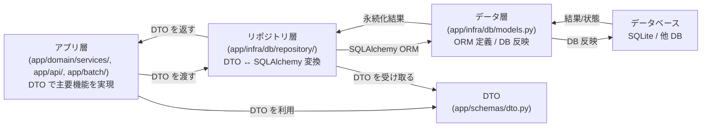

# HouseParchaseConcergeBot

住宅購入向けの **個人用コンシェルジュBot** です。  
候補条件に合う新着物件を定期取得し、AI が短い要約と優先度を付けて LINE に通知することを目指します。

> この README は、全体の設計を整理するためのものです。内部処理をするためのモジュール群を整理します

---

## メンタルモデル（ドメインモデルの全体像）


---

## メンタルモデル(層の全体像)

このプロジェクトは大きく次の 3 層アーキテクチャで設計します。

> ここで使う「アプリ層 / リポジトリ層 / データ層」は、このプロジェクト内での呼び方です。
> 一般的な言い回しでは「サービス層 / ビジネスロジック層 / ドメイン層」「リポジトリ層」「データアクセス層 / 永続化層」に近いイメージです。

- アプリ層
  - `app/domain/services/`, `app/api/`, `app/batch/` などの主要機能を実現するモジュール群。
  - `schemas/dto.py` の DTO を使って機能の入力・出力を表現する。
  - 例: 物件取得、正規化、フィルタリング、AI 評価、通知生成。
- リポジトリ層
  - `app/infra/db/repository/` 相当の層。
  - アプリ層のモジュールから DTO を受け取り、SQLAlchemy を使って永続化処理を実行する。
  - DB の差分を吸収し、後で DB を切り替えるときはこの層だけを修正すればよい。
- データ層
  - `app/infra/db/models.py` や `app/infra/db/base.py` など。
  - SQLAlchemy のテーブル定義と DB 反映の責務を持つ。
  - 実際の DB 書き込み・更新・削除を行う。

基本的には SQLAlchemy を用いて ORM ベースの永続化を行い、アプリ層は DB 実装の詳細に依存しません。

### 各層の責務と依存ルール

- アプリ層
  - SQLAlchemy の ORM クラスを直接知らない。
  - `app/schemas/dto.py` の DTO だけを扱う。
- リポジトリ層
  - DTO と SQLAlchemy の両方を知り、変換と永続化を担当する。
- データ層
  - SQLAlchemy のモデル定義と DB 反映を行い、DTO には依存しない。

依存の方向は単純に保ちます。

```text
アプリ層 -> リポジトリ層 -> データ層
```

### DTO の役割

DTO は「層をまたぐときのデータの形」です。
`app/schemas/dto.py` の Pydantic モデルを使って、アプリ層とリポジトリ層の間でデータを受け渡します。


### クラス設計
>本節では、主要なクラスの設計をまとめる。